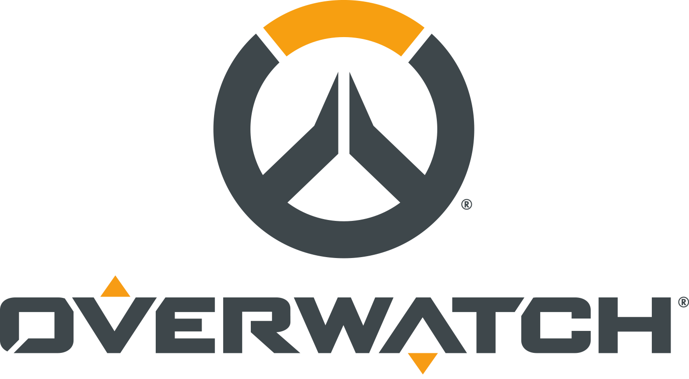

# Awesome Overwatch 

   
  

Curated list of official Overwatch links and community Github repos, Codepen demos, and Chrome extensions.

[**Read the blog post for some of the highlights.**](https://medium.com/p/what-i-found-curating-awesome-overwatch-c566c078acaf)

## Contents
- [Official](#official)
    - [Overwatch](#overwatch)
    - [Overwatch League](#overwatch-league)
    - [Overwatch Contenders](#overwatch-contenders)
    - [Overwatch World Cup](#overwatch-world-cup)
    - [Talks](#talks)
- [Community](#community)
    - [Chrome Extensions](#chrome-extensions)
    - [Codepen](#codepen)
    - [Github](#github)
    - [Others](#other)
- [License](#license)

## Official

> Links to official sites, media resources, and talks.

### Overwatch

- [Website](https://playoverwatch.com)
- [Twitch](https://www.twitch.tv/playoverwatch)
- [Youtube](https://www.youtube.com/channel/UClOf1XXinvZsy4wKPAkro2A)
- [Twitter](https://twitter.com/PlayOverwatch)
- [Facebook](https://www.facebook.com/PlayOverwatch)
- [Instagram](https://www.instagram.com/playoverwatch/)
- [Media Kits 1](https://playoverwatch.com/media/)
- [Media Kits 2](https://blizzard.gamespress.com/Overwatch)
- [Job Board](https://careers.blizzard.com/en-us/openings/all/overwatch,overwatch-league/all/all/1)

### Overwatch League

> The first major global esports league with city-based teams.

- [Website](https://overwatchleague.com)
- [Twitch](https://www.twitch.tv/overwatchleague)
- [App (Google Play)](https://play.google.com/store/apps/details?id=com.blizzard.owl)

### Overwatch Contenders

> A high-level tournament series for aspiring pro players who dream of ascending to the Overwatch League.

- [Website](https://contenders.playoverwatch.com/)

### Overwatch World Cup

> The annual search for the strongest nation in the world.

- [Website](https://worldcup.playoverwatch.com/en-us/)
- [Youtube Playlist, 2017](https://www.youtube.com/playlist?list=PLAYFVhxsaqDswRoWUDCCRmakRxFMlJ2tQ)

### Talks

> Industry experts, Blizzard developers, and official Overwatch team members discuss their process.

[GDC Search](http://www.gdcvault.com/search.php#&category=free&firstfocus=&keyword=overwatch&conference_id=)

- [Tools Tutorial Day: Playtesting 'Overwatch'](http://www.gdcvault.com/play/1025012/Tools-Tutorial-Day-Playtesting-Overwatch)
- [Animation Bootcamp: The First Person Animation of 'Overwatch'](http://www.gdcvault.com/play/1024319/Animation-Bootcamp-The-First-Person)
- [The Animation Pipeline of 'Overwatch'](http://www.gdcvault.com/play/1024267/The-Animation-Pipeline-of-Overwatch)
- [The Art of 'Overwatch': Evolving a Legacy](http://www.gdcvault.com/play/1024268/The-Art-of-Overwatch-Evolving)
- [Thinking Globally: Building the Optimistic Future of 'Overwatch'](http://www.gdcvault.com/play/1024266/Thinking-Globally-Building-the-Optimistic)
- [Animation Bootcamp: Overwatch: How a Hero is Mei-d](http://www.gdcvault.com/play/1023473/Animation-Bootcamp-Overwatch-How-A)
- [Overwatch - The Elusive Goal: Play by Sound](http://www.gdcvault.com/play/1023317/Overwatch-The-Elusive-Goal-Play)

## Community

> Projects, tools, and experiments developed by the community.

### Chrome Extensions

> Enhance your daily browsing experience.

- [i-need-healing](https://chrome.google.com/webstore/detail/i-need-healing/ifjangmbmgigcbpejdbifapfdgkbnnpm), [[Github]](https://github.com/xuezhma/i-need-healing) - I am Genji. I need healing. Chrome extension.
- [sounds-of-github](https://chrome.google.com/webstore/detail/sounds-of-github/dahmkeokilolnpmidacepocehjjhbhnp?hl=en-US&gl=US), [[Github]](https://github.com/cheshire137/sounds-of-github) - This is a Chrome extension to play sound effects whenever you leave a reaction on GitHub.
- [Overwatch League Spoiler Toggle](https://chrome.google.com/webstore/detail/overwatch-league-spoiler/gpobbefkohjkdjepfnkginpnaaifilpm) - Allows visitors to overwatchleague.com to show/hide match spoilers.
- [Overwatch League Reminder](https://chrome.google.com/webstore/detail/overwatch-league-reminder/digohcafgieaejiembjcjnkcomejnhim) - Be informed of the date of the next match and notified when the stream starts.
- [Overwatch Contenders Reminder](https://chrome.google.com/webstore/detail/overwatch-contenders-remi/fpicgfdedklnoadapbkhnndllglaadpe) - Be informed of the date of the next Overwatch Contenders match and notified when the stream starts.
- [Overwatch Profile Search](https://chrome.google.com/webstore/detail/overwatch-profile-search/apkmoangdplpamkijkcapaiinookmaia) - Search Overwatch profiles based on platform and region.

### Codepen

> Live demos, re-creations, and experiments.

- [Overwatch Hero Gallery](https://web.archive.org/web/20180326123314/https://codepen.io/TunaSurf/full/WXjyGE/) - Most fleshed out version of the hero gallery on Codepen.
- [Pure CSS Tracer](https://web.archive.org/web/20180326123756/https://codepen.io/bentok/full/qNZjxv/) - Pure CSS Tracer inspired logo.
- [Overwatch Snow 2017](https://web.archive.org/web/20180326123836/https://codepen.io/mmolad/full/wpvYLK/) - Overwatch snow recreated in pure CSS.
- [Overwatch Snow Effect](https://web.archive.org/web/20180326124102/https://codepen.io/mmolad/full/JGYNaV/) - Overwatch snow recreated in pure CSS.
- [Overwatch Pixel Sprays in HTML/CSS](https://web.archive.org/web/20180326123914/https://codepen.io/rspilhaus/full/zwgMwd/) - Recreating pixel sprays using CSS box-shadow pixel art technique.
- [overwatch logo](https://web.archive.org/web/20180326124409/https://codepen.io/SkyHolder/full/boPNqj/) - Overwatch logo recreated in pure CSS.
- [Overwatch (logo)](https://web.archive.org/web/20180326124238/https://codepen.io/stix/full/bpJoLy/) - Overwatch logo recreated in pure CSS.
- [Overwatch Main Menu](https://web.archive.org/web/20170524173713/http://codepen.io:80/KuroNoDev/full/YVRrNq) - Main menu for the game recreated in HTML and CSS. Even has chat (I need healing!).
- [Overwatch Mode Select Screen](https://web.archive.org/web/20180326125031/https://codepen.io/jjmartucci/full/xOKewL/) - Mode select screen after main menu recreated.
- [Overwatch D.Va Pixel Boosters](https://web.archive.org/web/20180514081522/https://codepen.io/Likethemammal/full/yvrLBQ) - Pixel D.Va flies across the page using HTML Canvas.

### Github

> Open-source repos for frameworks, projects, tools, demakes, and demos.

- [dvajs](https://github.com/dvajs/dva) - Lightweight front-end framework based on redux, redux-saga and react-router. (Inspired by elm and choo).
- [react-overwatch-picker](https://github.com/johnrjj/react-overwatch-picker) - Overwatch Hero Picker in React.
- [overwatchxp](https://github.com/njallam/overwatchxp) - Overwatch XP Calculator.
- [competiwatch](https://github.com/cheshire137/competiwatch) - Web app to track and visualize your competitive match history in Overwatch.
- [overwatch-team-comps](https://github.com/cheshire137/overwatch-team-comps) - Plan your Overwatch team composition per map. Share your team comp with others.
- [overwatch-counter-picker](https://github.com/cheshire137/overwatch-counter-picker) - See which hero you should pick in Overwatch based on your team composition.
- [overwatch-hero-picker](https://github.com/geddski/overwatch-hero-picker) - Let’s build the awesome Hero Picker UI from Overwatch.
- [CompetitiveOverwatch](https://github.com/competitiveoverwatch) - Overwatch Organization for /r/CompetitiveOverwatch.
- [overwatch-hero-abilities-base](https://github.com/javabird25/overwatch-hero-abilities-base) - This addon lets to have multiple Overwatch Hero Abilities addons installed at the same time.
- [genji-abilities](https://github.com/javabird25/genji-abilities) - This addon for Garry's Mod lets you to use the abilities of Genji from Overwatch.
- [tracer-abilities](https://github.com/javabird25/tracer-abilities) - This addon for Garry's Mod lets you to use the abilities of Tracer from Overwatch.
- [overwatch-spray-extract](https://github.com/knkcni/overwatch-spray-extract) - An easy way to get every sprays from Overwatch using Docker.
- [McCree-Hammershot](https://github.com/dmadison/McCree-Hammershot) - Code and other files for the McCree Hammershot controller.
- [widoughmaker](https://github.com/rudeism/widoughmaker) - Arduino code for building a custom controller for Widowmaker!
- [Overwatch-Stream-Rank-Overlay](https://github.com/Kataiser/Overwatch-Stream-Rank-Overlay) - Displays Overwatch comp rank on stream.
- [I-Need-a-Hero](https://github.com/Kataiser/I-Need-a-Hero) - Automatic hero suggester for Overwatch.
- [NerfThis](https://github.com/thisiswhale/NerfThis) - A database that allows players to submit their win/loss games. As a collective whole, it will suggests best heroes to play based on selected parameters.
- [overwatch-spider](https://github.com/merrier/overwatch-spider) - 🐞 Overwatch Spider with NodeJS + node-crawler.
- [gfywatch](https://github.com/bmhatfield/gfywatch) - Overwatch Recordings -> Gfycat. Upload your POTG!
- [STUTools](https://github.com/SombraOW/STUTools) - Automated deserialization of Overwatch's STU assets in C# and C++ (WIP).
- [OWLib](https://github.com/overtools/OWLib) - Series of programs (tools) to interact with the Overwatch files.
- [Overwatch-Item-Tracker](https://github.com/Js41637/Overwatch-Item-Tracker) - Track what event items you have unlocked.
- [otg](https://github.com/omriiii/potg) - Overwatch Play of the Game screenshot generator.
- [Underwatch](https://github.com/n33kos/underwatch/) - A Pico-8 objective based team shooter demake.
- [OverwatchProgress](https://github.com/zjywill/OverwatchProgress) - An android loading view mock Overwatch style.
- [OverWatchLoading](https://github.com/zhangyuChen1991/OverWatchLoading) - Overwatch Loading Animation.
- [overwebs](https://github.com/ruphin/overwebs) - Overwatch UI in HTML using Polymer.
- [sombra](https://github.com/bahamas10/sombra) - Sombra ARG for overwatch.
- [overwatch-dpi-tool](https://github.com/Pyrolistical/overwatch-dpi-tool) - This tool will calculate if a given DPI, in-game sensitivity, and FOV is good enough for various screen sizes.
- [Overwatch_theme](https://github.com/Matthaz/Overwatch_theme) - Overwatch theme for Discord.
- [overwatchop](https://github.com/freehealthcare/overwatchop) - Omnic - An Overwatch Strategy App.
- [owl-ranking](https://github.com/itsnhduc/owl-ranking) - Detailed OWL Ranking.
- [heropicker](https://github.com/ufo22940268/heropicker) - Automatically pick a hero in Overwatch. Auto Hotkey (ahk).
- [overwatch-team-balancer](https://github.com/seanmarthur/overwatch-team-balancer) - Given a set of battle tags, attempts to balance based on their current competitive SR.
- [OverwatchCounters](https://github.com/andrewkarch/OverwatchCounters) - Overwatch Team Generator.
- [overwatch-settings-select](https://github.com/likethemammal/overwatch-settings-select) - A React component modeling the Overwatch Settings select element.
- [overwatch-settings-stepper](https://github.com/likethemammal/overwatch-settings-stepper) - A React component modeling the Overwatch Settings the stepper and toggle UI elements.
- [overwatch-table](https://github.com/likethemammal/overwatch-table) - A React component modeling the Overwatch custom game table element.
- [overwatch-side-nav](https://github.com/likethemammal/overwatch-side-nav) - A React component modeling the Official Overwatch website side-navigation.
- [dva-heart-emote](https://github.com/likethemammal/dva-heart-emote) - A WebGL remake of the heart container animation from D.Va's emote.

#### AI / Machine Learning (ML)

> AI principles and practices applied to Overwatch.

- [C0derwatch](http://www.c0derwatch.com/) - Uses deep learning to analyze how games should go.
- [OverwatchML](https://github.com/sshh12/OverwatchML) - Overwatch + AI.
- [OverwatchRankingProject](https://github.com/gaaliciA1990/OverwatchRankingsProject) - The goal is to create a predictive model for competitive ranking.

#### APIs

> Unofficial NodeJS, GraphQL, Go, JSON, and RESTful APIs.

- [overwatch-api](https://github.com/alfg/overwatch-api) - 🌎 An Unofficial Overwatch HTTP API.
- [infra-sight](https://github.com/aidant) - An unofficial API for Overwatch.
- [overwatch-api](https://github.com/jamesmcfadden/overwatch-api) - A RESTful API for the Overwatch Game.
- [cowapi](https://github.com/azah/cowapi) - A Crystal implementation of OWAPI.
- [oversmash](https://github.com/filp/oversmash) - Overwatch API library for player details and career stats.
- [oversmash-api](https://github.com/filp/oversmash-api) - GraphQL API for Overwatch player information and stats.
- [overwatch-js](https://github.com/gclem/overwatch-js) - Overwatch NodeJS API : Retrieve information about heroes/players from Overwatch Official Website.
- [overwatch-webapi](https://github.com/gclem/overwatch-webapi) - Overwatch JSON API Hosting based on overwatch-js npm package functionality.
- [ovrstat](https://github.com/sdwolfe32/ovrstat) - 🎮 A Fast and Detailed Unofficial Overwatch Stats API written in Go.
- [OWLeagueLib](https://github.com/overtools/OWLeagueLib) - An easy-to-use library for interacting with the Overwatch League web API.

#### Bots

> Discord and Twitter bots. Not aim bots.

- [ow-dancing-bot](https://github.com/aechaves/ow-dancing-bot) - I post Mercy dancing clips and hope to post more heroes and music someday. 
- [peanut-botter](https://github.com/niksudan/peanut-botter) - 🎮 Discord bot for Overwatch.

#### Lighting

> Keyboard and setup lighting with Overwatch integration.

- [overlights](https://github.com/bengreenier/overlights) - Reactive Overwatch lighting.
- [Aurora](https://github.com/antonpup/Aurora) - Unified lighting effects across multiple brands and various games.

### Other

#### 3D Models

> Open models for levels, weapons, heros, effects, and more.

- [3d warehouse](https://3dwarehouse.sketchup.com/search/?backendClass=entity&q=%23Overwatch)
- [Sketchfab](https://sketchfab.com/search?q=overwatch&sort_by=-pertinence&type=models)

#### Trello

> Trello boards for open-source project.

- [Omnic](https://trello.com/b/esR6xVgp/%F0%9F%A4%96-omnic) - Trello Board for the 'Omnic' app.
- [I Need A Hero](https://trello.com/b/7pb5hLHX) - Trello Board for 'I Need A Hero' app.

## License

 This work is licensed by Chris Dolphin under a <a rel="license" href="http://creativecommons.org/licenses/by-sa/4.0/">Creative Commons Attribution-ShareAlike 4.0 International License</a>.
